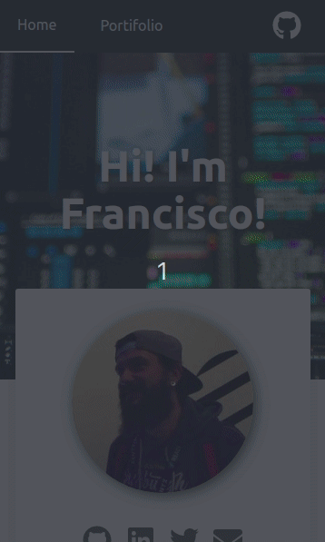

[](https://travis-ci.org/santosfrancisco/gatsby-starter-cv)
[](https://badge.fury.io/gh/santosfrancisco%2Fgatsby-starter-cv)
[](http://commitizen.github.io/cz-cli/)

<p align="center">
  <a href="https://www.gatsbyjs.org">
    
  </a>
</p>
<h1 align="center">
  Gatsby's CV starter
</h1>

Create your resume in a few minutes with this totally responsive starter using React. Show off your skills, work experiences and activities in github.

### Sections
- About
- Skills
- Job experiences
- Github repositories
- Portifolio

### Features
- Responsive Design, optimized for Mobile devices
- Google Analytics
- SEO
- PWA
- Dark mode
- Animations

## 📷 Preview

### Mobile



### Desktop


## 🚀 Quick start

1.  **Create a Gatsby site.**

    Use the Gatsby CLI to create a new site, specifying the default starter.

    ```sh
    # create a new Gatsby site using the default starter
    npx gatsby new my-default-starter https://github.com/santosfrancisco/gatsby-starter-cv
    ```

2.  **Start developing.**

    Navigate into your new site’s directory and start it up.

    ```sh
    cd my-default-starter/
    npm run develop
    ```

3.  **Open the source code and start editing!**

    Your site is now running at `http://localhost:8000`!

    \_Note: You'll also see a second link: `http://localhost:8000/___graphql`. This is a tool you can use to experiment with querying your data. Learn more about using this tool in the [Gatsby tutorial](https://www.gatsbyjs.org/tutorial/part-five/#introducing-graphiql).\_

    Open the `my-default-starter` directory in your code editor of choice and edit `src/pages/index.js`. Save your changes and the browser will update in real time!

4. **Generate production build**

    That command will generate a production build on _public_ folder
    ```sh
      npm run build
    ```

5. **Deploy to Github pages**

    That command will deploy the production build to gh-pages branch of your repository
    > ⚠️ don't forget to check `pathPrefix` in the configuration file.


    ```sh
      npm run deploy
    ```

## Configuration

Update the configuration file with your data. The configuration file is in ```data/siteConfig.js```

:warning: NOTE: Please change googleAnalyticsId to your ID.  See https://analytics.google.com for details.

> **Skills** is a set of your personal skills and their respective levels ranging from > 0 to 100.
> **jobs** is a set of your work experiences

```js
  module.exports = {
    siteTitle: 'Hi! I\'m Francisco!',
    siteDescription: `Create your online curriculum in just a few minutes with this starter`,
    keyWords: ['gatsbyjs', 'react', 'curriculum'],
    authorName: 'Francisco Santos',
    twitterUsername: '_franciscodf',
    githubUsername: 'santosfrancisco',
    authorAvatar: '/images/avatar.jpeg',
    authorDescription: `Developer, passionate about what I do. Always interested in how the sites were made, I started to study HTML by hobby. <br />
      In 2012 I started working as a support technician and I approached the developers.
      In 2015, I started to study C # and started to contribute with the team giving maintenance in an application in C # and .NET. <br />
      I currently work as a frontend developer and mainly work with <strong>Javascript, NodeJS e React.</strong>`,
    skills: [
      {
        name: 'HTML',
        level: 70
      },
      {
        name: 'CSS',
        level: 60
      },
      {
        name: 'Javascript',
        level: 50
      },
      {
        name: 'NodeJs',
        level: 40
      },
      {
        name: 'React',
        level: 60
      },
      {
        name: 'Git',
        level: 70
      },
      /* more skills here */
    ],
    jobs: [
      /* more jobs here */
      {
        company: "Gympass",
        begin: {
          month: 'sep',
          year: '2019'
        },
        duration: null,
        occupation: "Frontend developer",
        description: "I am part of the Corporate team, responsible for the development and maintenance of the employee management platform, giving more and more autonomy to partner companies."
    
      },  {
        company: "Lendico",
        begin: {
          month: 'apr',
          year: '2018'
        },
        duration: null,
        occupation: "Frontend developer",
        description: "I integrate the Frontend team responsible for developing and maintaining the online lending platform."
    
      }, {
        company: "Anapro",
        begin: {
          month: 'dec',
          year: '2016'
        },
        duration: '1 yr e 5 mos',
        occupation: "Fullstack developer",
        description: "Development and maintenance, corrective and preventive, of web applications for the real estate market."
      }, {
        company: "Anapro",
        begin: {
          month: 'set',
          year: '2012'
        },
        duration: '4 yrs e 3 mos',
        occupation: "Support Technician",
        description: "Responsible for the implementation and parameterization of the system, training and customer support. Acting also in person in real estate launches guaranteeing the success and good use of the tool."
    
      },
    ],
    portifolio: [
      {
        image: "/images/gatsby-starter-cv.png",
        description: "Gatsby starter CV template",
        url: "https://www.gatsbyjs.org/starters/santosfrancisco/gatsby-starter-cv/"
      },
      {
        image: "/images/awesome-grid.png",
        description: "Responsive grid for ReactJS",
        url: "https://github.com/santosfrancisco/react-awesome-styled-grid"
      },
      /* more portifolio items here */
    ],
    social: {
      twitter: "https://twitter.com/_franciscodf",
      linkedin: "https://www.linkedin.com/in/santos-francisco",
      github: "https://github.com/santosfrancisco",
      email: "yoshi.df@gmail.com"
    },
    siteUrl: 'https://santosfrancisco.github.io/gatsbystarter-cv',
    pathPrefix: '/gatsby-starter-cv', // Note: it must *not* have a trailing slash.
    siteCover: '/images/cover.jpeg',
    googleAnalyticsId: 'UA-000000000-1',
    background_color: '#ffffff',
    theme_color: '#25303B',
    fontColor: "#000000cc",
    enableDarkmode: true, // If true, enables dark mode switch
    display: 'minimal-ui',
    icon: 'src/assets/gatsby-icon.png',
    headerLinks: [
      {
        label: 'Home',
        url: '/',
      },
      {
        label: 'Portifolio',
        url: '/portifolio',
      }
    ]
  }

```

## It was useful?

<a href="https://www.buymeacoffee.com/santosfrancisco" target="_blank"></a>
